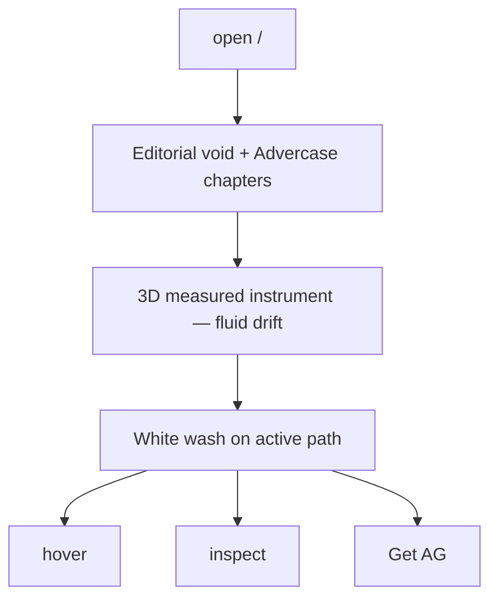

# Userflows — Process Instrument in the Void
**DESIGN_SYSTEM_FIRST LIVE:** #45 @ `ead012f` — DS before pixels; Research×UX Cos signoff; Design/Experience/Branding paramount.

**Paul LOCK hybrid.** Cite #43 @ `7e9e0b6` + #37 + #38 + #40.

## F1 — Land
Void + numbered chapters + drifting 3D instrument. Path wash Research→Recap. Next hatched.

## F2 — Hover — past-tense chapter story
## F3 — Inspect — closer 3D + narrative
## F5 — Toast on measured ship
## F7 — Admin twin — no Get AG
