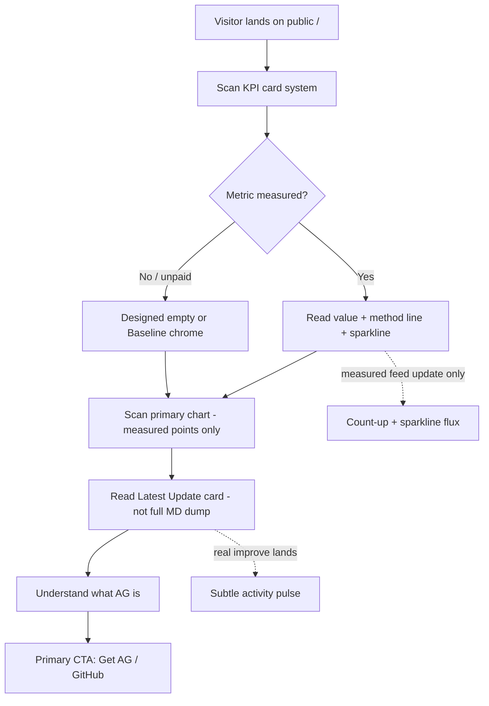
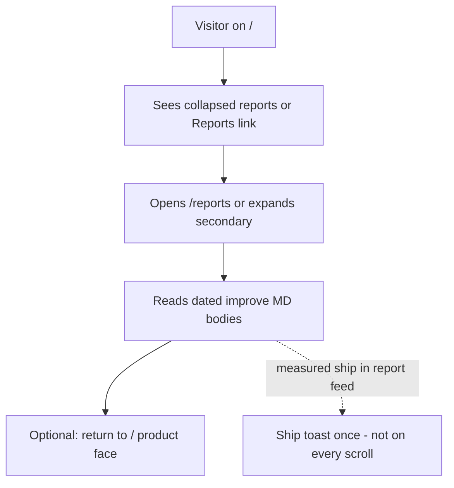
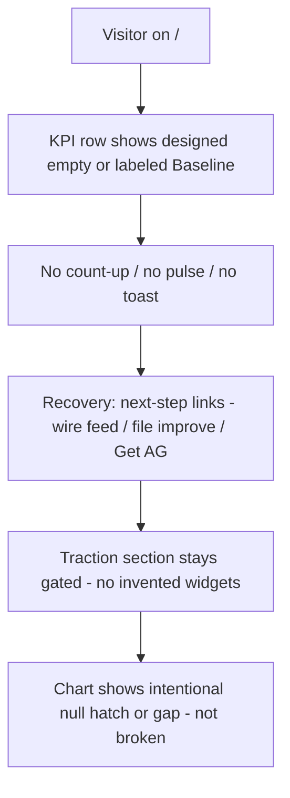

# Public dashboard — Check 7 userflows

**Cite:** [`../research/evidence.md`](../research/evidence.md) (ADV_COMP + Motion / delight patterns) 
**Scope:** Product UX for public `/` and secondary `/reports` (or collapsed reports). Not OpenClaw briefs. Not Eng UI. 
**Cos LOCK add-on 2026-09-13:** Delight moments fire only on **measured events** — not decoration.

---

## Delight rule (all flows)

| Moment | Fires only when | Does not fire |
| --- | --- | --- |
| KPI count-up | Measured feed updates (improve MD KPI, merged PRs, retros) | Baseline / unpaid tiles; page idle |
| Sparkline flux | New measured point lands on that series | Random jitter; empty series |
| Activity pulse | Real improve entry / measured gain recorded | Fake ticker; invented pulse |
| Ship toast | Measured ship event recorded (e.g. merged PR into feed) | Simulated “live” ships |

Traction stays gated. Designed empty/baseline required when unpaid.

---

## Flow A — Landing → KPI scan → understand AG → primary CTA

Evidence: Stripe / Amplitude / Cloudflare KPI cards; Linear Latest Update; Mixpanel/Neon designed empty — see evidence §3 and §7.

---

## Flow B — Landing → open reports secondary

Evidence: Linear Progress rail + Latest Update (report as card on `/`; full MD secondary) — evidence §3 Linear cites, §7 ship toast.

---

## Flow C — Empty / baseline path (metrics unpaid)

Evidence: Mixpanel empty, Amplitude no-match, Neon hatch — evidence §3 and motion do-not-copy §6.

---

## Mobile vs desktop

- **Desktop:** KPI grid + chart + Progress/Latest Update rail readable in one composition.
- **Mobile:** Same hierarchy stacked; delight moments unchanged (still measured-only) but Check 8 stills must cover both.
- Check 8 `VISUAL_STEP_STILLS` (with **motion note per primary step**) come next — stills to Cos before Eng. See [README.md](./README.md).
