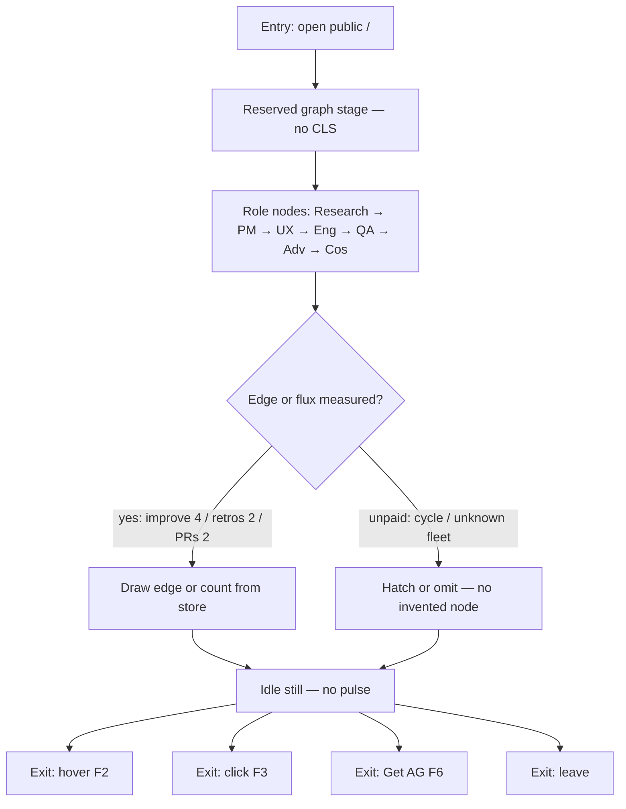
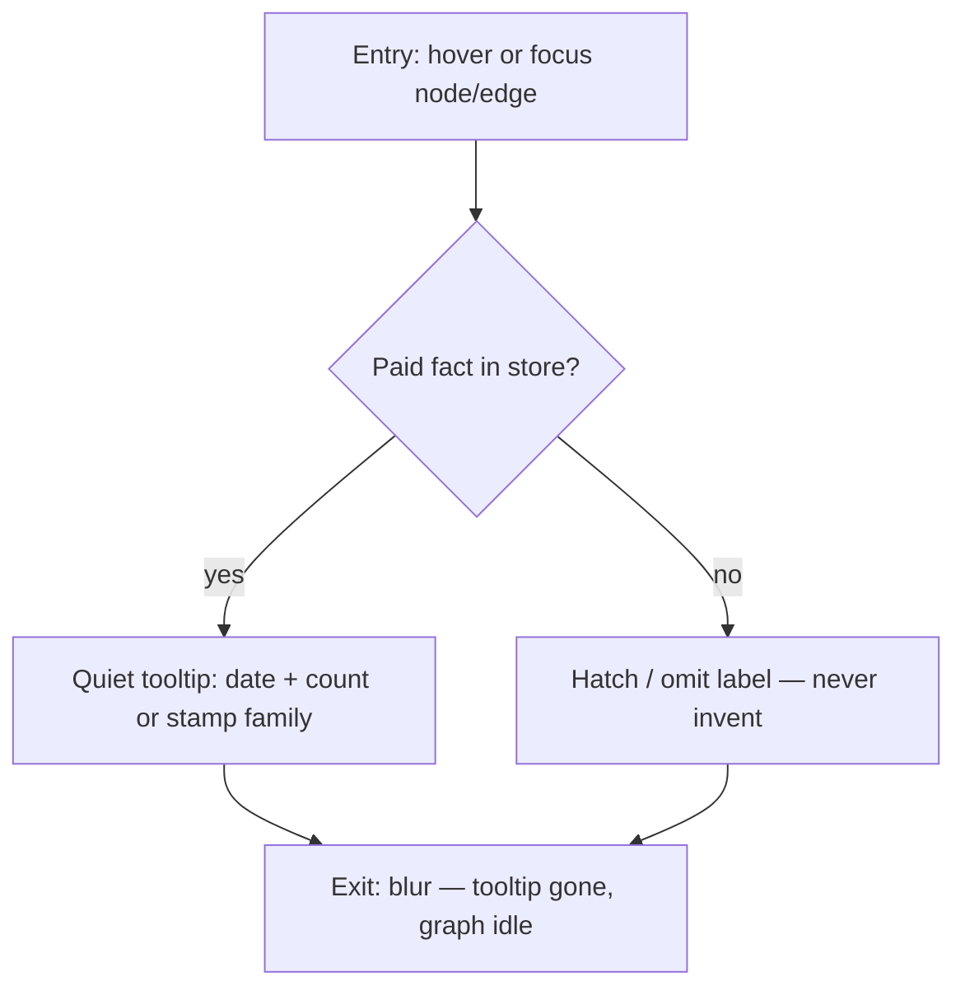
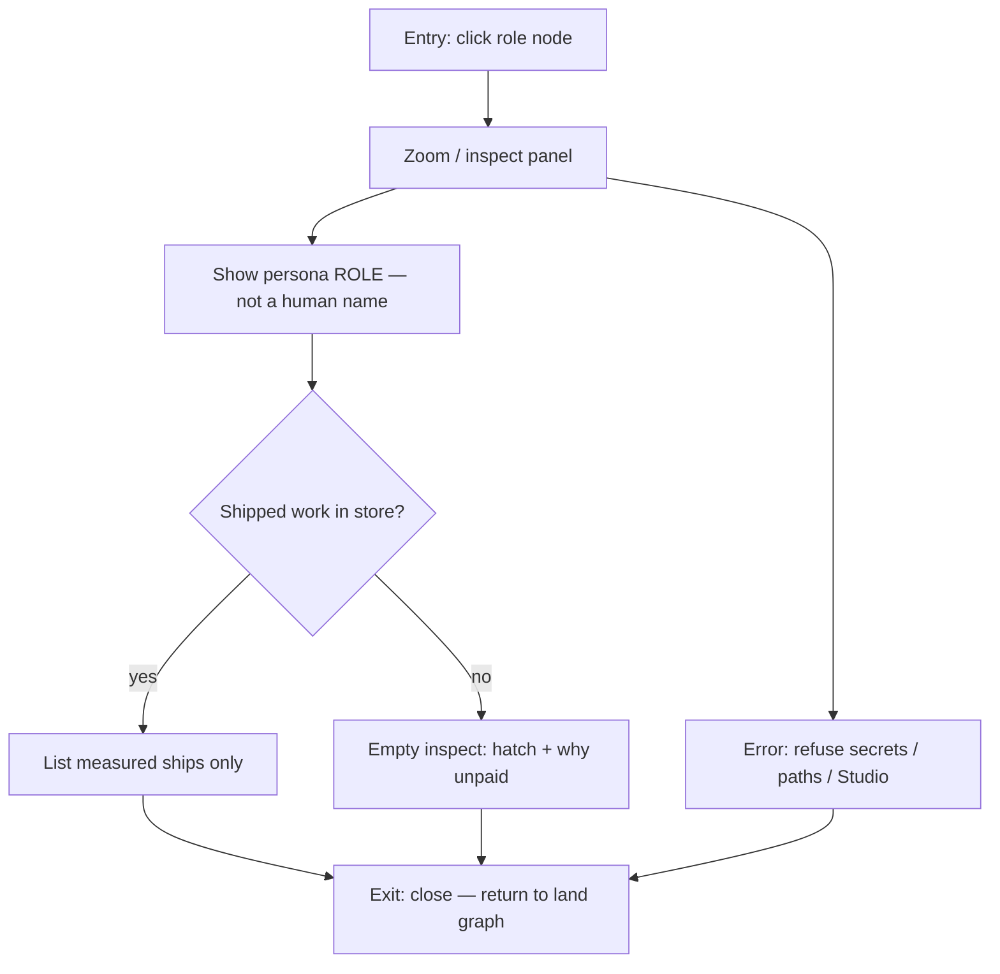
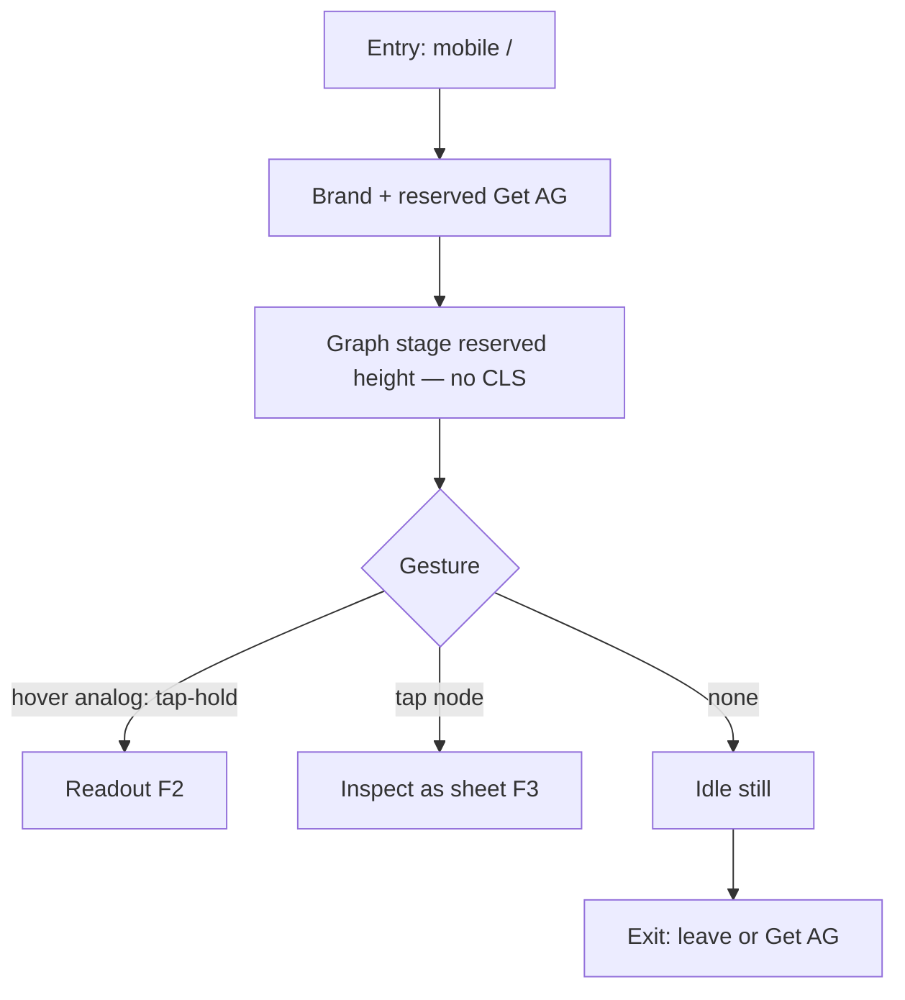
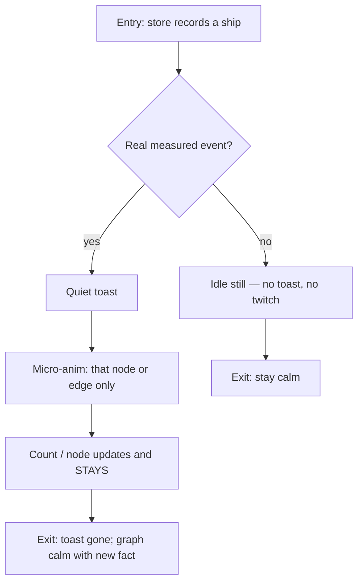
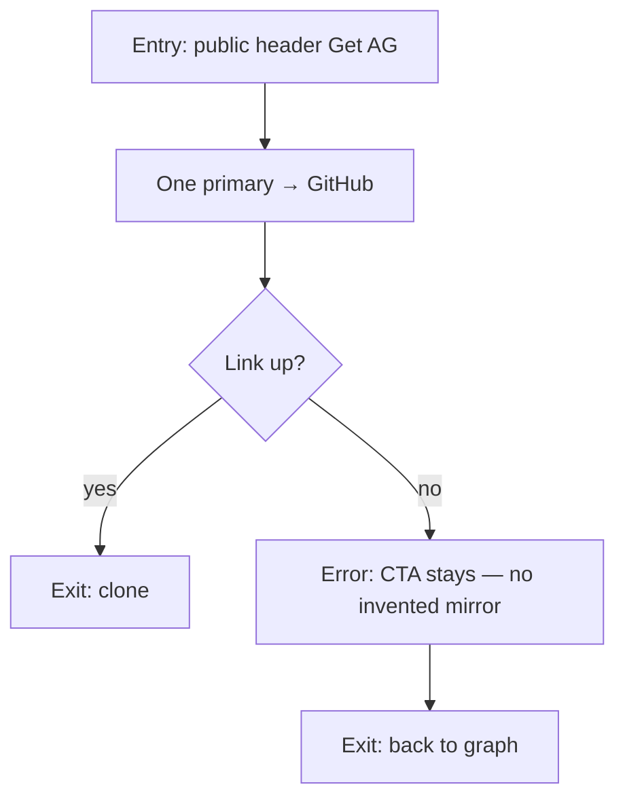
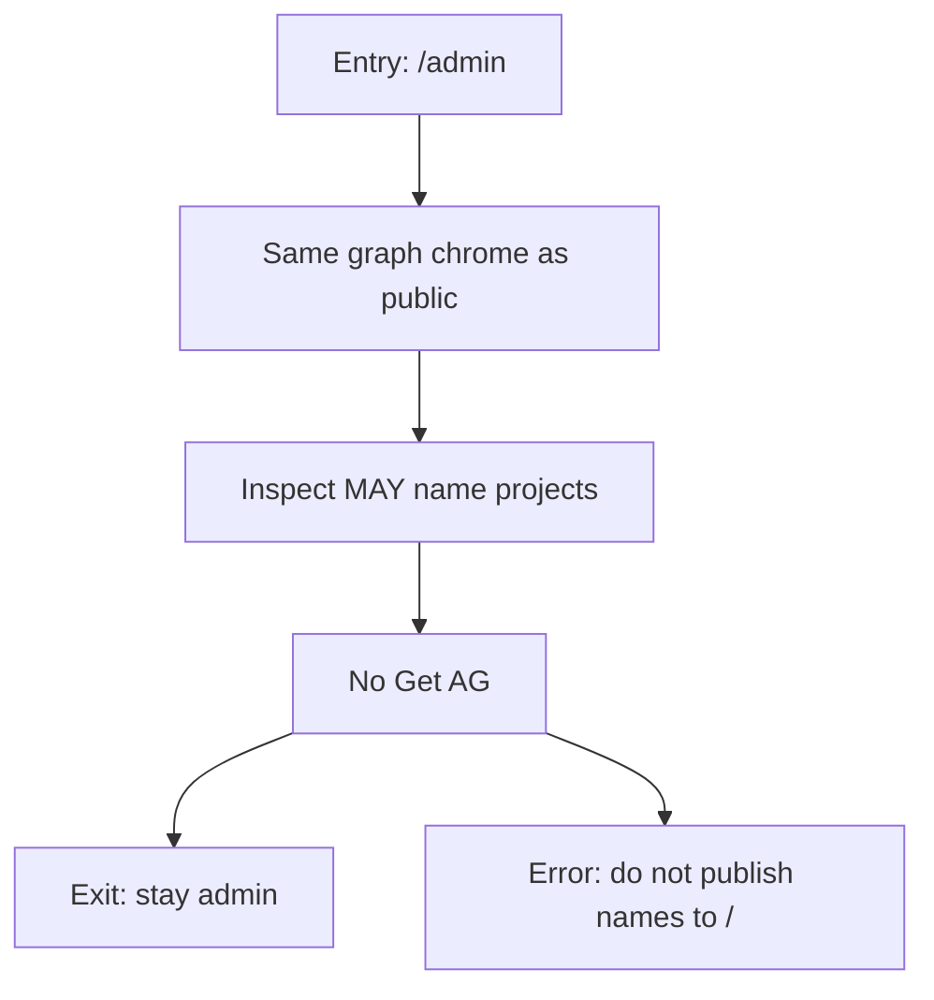

# Userflows — Living graph splash + admin twin

**Gate:** Critic Check 7 — Mermaid (entry, success, empty/error, exits). 
**Jobs:** [`jtbd.md`](./jtbd.md) J1–J7. 
**Splash SoT:** #28 @ `f9f38ff` [`living-graph-splash-2026-09-13.md`](../research/living-graph-splash-2026-09-13.md). 
**Motion SoT:** #27 @ `235610e`. Honesty SoT: #20 @ `9721af1`. 
**Supersedes:** F1 “Land & scan KPIs” strip. Land is **explore-the-graph**. 
**Chrome (Jakob):** Brand + one **Get AG** on public desk and mobile. Graph is the product. Mobile: no CLS on graph (reserved stage height). Admin: same graph chrome, no Get AG.

**Measured on frames (do not invent):** Daily improve **4**, Retros **2**, Merged PRs **2** (12 Sep). Cycle unpaid → hatch/omit. Role nodes are the locked loop, not invented projects. Fleet names omitted on public.

---

## F1 — Land default graph (J1)

Entry: open `/`. Success: they see the loop graph, idle still. Empty: unpaid edges hatched/omitted. Exit: hover (F2), click (F3), Get AG (F6), leave.

**Cite:** #28 §1–2, §5 do-not-copy strip / force-graph / fake pulse. Fitness paused = idle still.

---

## F2 — Hover / focus readout (J2)

Entry: pointer or keyboard focus on a node or edge. Success: one quiet tooltip (date / count / stamp family). Empty: unpaid → hatch label, no number. Exit: blur back to idle graph.

**Cite:** #28 §3b Stripe / Arcade hover. Public: no project name in tooltip.

---

## F3 — Click → inspect seat (J3)

Entry: click a role node. Success: zoom/inspect — ROLE + shipped work. Error: no shipped facts → designed empty inspect. Exit: close inspect, back to land.

**Cite:** #28 §3a Cofounder / Railway / Twenty inspect. Competitor-hole: n8n / LangSmith IDE. Public: no project names.

---

## F4 — Mobile graph (J1, Jakob)

Entry: open `/` on a phone. Success: same graph, reserved height, no layout shift. Inspect is a sheet, not a new chrome family. Exit: same as F1–F3.

**Cite:** #28 mobile stills required; Check 8 FAIL = CLS / chrome inconsistency.

---

## F5 — Toast-on-ship, then node stays (J6)

Entry: measured ship/merge/retro written to the store. Success: quiet toast + one node/edge twitch + count remains. Idle: nothing. Exit: toast dismisses; new count stays.

**Cite:** #28 §2 rules 6–7; Linear toast; #27 toast; Fitness idle still. No fake ticker.

---

## F6 — Get AG (J4)

Entry: header Get AG. Success: GitHub. Admin: this control does not exist.

**Hick / Fitts:** Graph nodes are not CTAs. One Get AG, reserved width. Admin: zero Get AG.

---

## F7 — Admin twin (J7)

Entry: signed-in `/admin`. Success: same dark graph language; project names allowed in inspect. Empty: unpaid hatch. Exit: stay in admin; never leak names to public `/`.

**Cite:** #28 §1 admin; Cos same board language.

---

## Mobile vs desktop (Jakob)

Same graph, same loop, same Get AG on public. Mobile inspect = sheet. Graph stage has reserved height (no CLS). Documented exception: desktop may show a side inspect rail (Twenty / Databricks); mobile uses a sheet.

---

## Acceptance (Check 7)

| Field | Value |
| --- | --- |
| Mermaid | F1–F7 entry / success / empty-error / exits |
| Map | F1→J1, F2→J2, F3→J3, F4→J1 mobile, F5→J6, F6→J4, F7→J7 |
| Research | #28 @ `f9f38ff` + #27 @ `235610e` + #20 @ `9721af1` |
| Next | Check 8 GO after LIVE #28 @ f9f38ff. Then phone-first: default land, live-update twitch, zoomed inspect, mobile land+inspect, admin twin |
