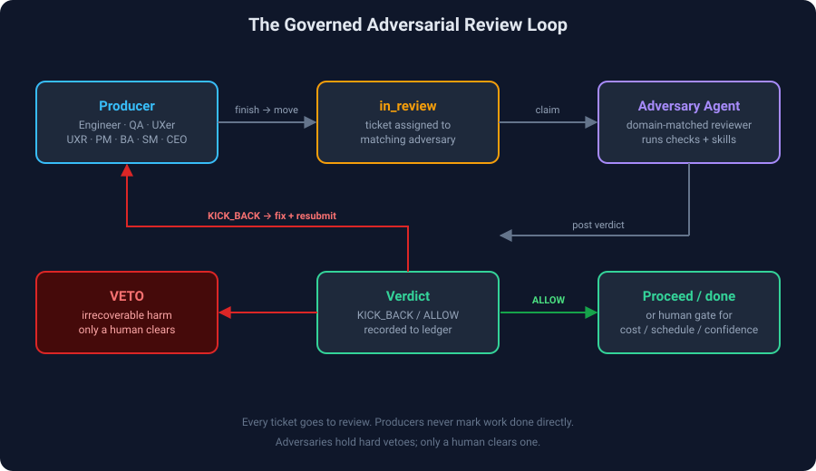

# Architecture

The governed adversarial review loop, end to end.



## The loop

```
┌────────────┐ finish ┌──────────────┐ claim ┌──────────────────┐
│ Producer │ ──────────► │ in_review │ ─────────► │ Adversary agent │
│ (Engineer, │ move to │ (ticket) │ assign to │ (domain-matched)│
│ QA, UXer, │ in_review │ │ reviewer │ │
│ UXR, PM…) │ └──────────────┘ └────────┬─────────┘
└────────────┘ │
        ▲                                                       │ run checks
        │ KICK_BACK (reassign + findings)                       ▼
        │                                              ┌──────────────────┐
        └────────────────────────────────────────────── │  Verdict         │
           fix + resubmit                               │  KICK_BACK/ALLOW │
                                                        └────────┬─────────┘
                                                                 │ ALLOW
                                                                 ▼
                                                        ┌──────────────────┐
                                                        │  Proceed / done  │
                                                        │  (or human gate) │
                                                        └──────────────────┘
```

## Key properties

1. **Every ticket goes to review.** No producer marks work done directly.
   Completion always means `in_review` + assignment to the matching adversary.
2. **Domain-matched routing.** The producer assigns to the adversary for its
   domain (Engineer → Adversarial Engineer, UXer → Adversarial UX, …). The
   Universal adversary is the catch-all for anything not covered.
3. **Hard vetoes.** Each domain's constitution defines irrecoverable-harm
   conditions (data loss, security hole, user harm, unsupported claim). If an
   adversary finds one, the work is kicked back and **only a human clears it**.
4. **Kick back, don't argue.** Producers must address findings, not argue them
   away. A veto is not negotiable by the producer.
5. **Calibration.** Every verdict is recorded to the calibration ledger so the
   framework's own behavior is auditable and improvable.

## The adversary agents

Each domain plugin ships a small set of adversary agents that play distinct
roles in the review:

- **A mechanical critic** — checks completeness, standards compliance, and
  that real options were explored (not minor variations).
- **An advocate with a hard veto** — holds the line on irrecoverable harm.
- **A stress reviewer** — walks the work as personas/scenarios (first-timer,
  midnight pager, screen-reader user, skeptic) to find blind spots.

The Universal domain collapses this into a single adversary that runs four
domain-agnostic checks (altitude, trade-off, harm/blind-spots, falsifiability).

## Stateless skills

Skills are stateless, single-purpose procedures the adversary agents invoke
(e.g. `ux-altitude-check`, `eng-threat-model`, `qa-release-gate`). They are
namespaced by domain in the flat layer (`ux-`, `eng-`, `qa-`, `res-`, `univ-`)
so they can coexist in Cursor/Claude without collision.

## Two execution surfaces

1. **Paperclip agent team** — the 5 adversary agents are live Paperclip agents
   that claim `in_review` tickets and post verdicts. See [[Paperclip]].
2. **MCP server** — the same review logic exposed as callable tools for any
   agent or client. See [[MCP]].

## See also

- [[Domains]] · [[Constitution]] · [[Vetoes]] · [[Calibration]] · [[MCP]] · [[Paperclip]]
